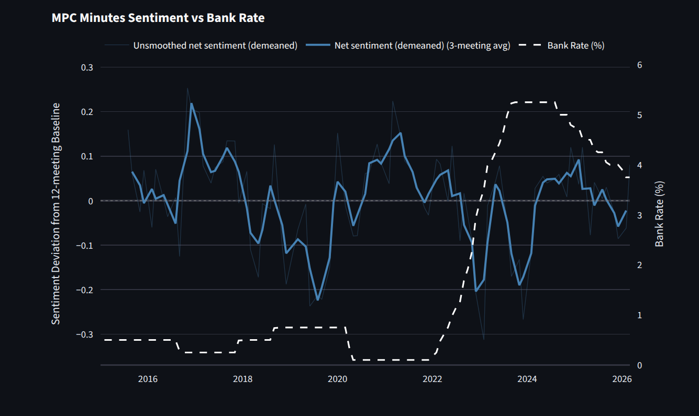

# BoE MPC Sentiment Analysis
## **🔗 [Live dashboard](https://boe-mpc-sentiment.streamlit.app/)**

NLP sentiment analysis tool that runs **FinBERT** (a BERT model fine-tuned on financial texts)
to Bank of England Monetary Policy Committee (MPC) minutes,
analysing the tone of UK monetary policy communications between 2015-2026.


---

## Motivation
MPC communications are themselves policy instruments, updating expectations about growth, inflation and market pricing.
The project aims to make the shift in tone withing those meetings quantifiable and explorable; it is plotted with the
Bank Rate series to make the relationship explicit.

---

## Features
 
- **Sentiment time series** — FinBERT positive/negative/neutral scores per meeting, aggregated into a net sentiment score
- **Base rate overlay** — sentiment plotted against the official Bank Rate to visualise the relationship between language and policy
- **Smoothing controls** — rolling average window to surface trends through meeting-to-meeting noise
- **Date range filter** — zoom into specific episodes (GFC, Covid shock, 2021–23 inflation cycle)


---

## Pipeline
 
```
MPC PDFs (BoE website)
        │
        v
  requests (download PDFs)
        |
        v
  pdfplumber (extract text + clean output)
        │
        v
  FinBERT (ProsusAI/finbert via HuggingFace)
  + positive / negative / neutral scores per sentence
        │
        v
  pandas (aggregate scores -> compute meeting-level sentiment index)
        │
        v
  sentiment_scores_full.csv
        │
        v
  Streamlit dashboard (deployed on Streamlit Cloud)
  + Exploration and illustration
```

Model inference runs locally in [Link text](notebooks/03_sentiment_analysis.ipynb) and creates a CSV of aggregated scores.
Streamlit reads from the CSV and creates an interactive dashboard.

---

## Running locally
 
```bash
git clone https://github.com/adrymmm/boefinbert.git
cd boefinbert
pip install -r requirements.txt
streamlit run app.py
```
---

## Potential Extensions
- Granger causality test: does MPC sentiment *lead* rate changes?
- Loughran-McDonald dictionary baseline comparison

---