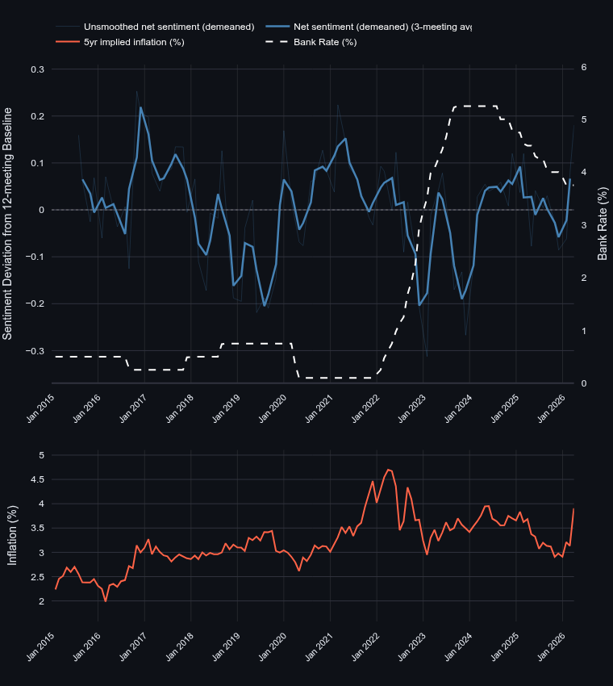
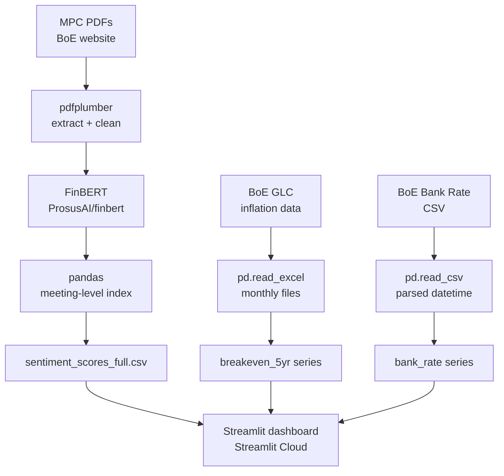

# BoE MPC Sentiment Analysis
## **🔗 [Live dashboard](https://boe-mpc-sentiment.streamlit.app/)**

NLP sentiment analysis tool that runs **FinBERT** (a BERT model fine-tuned on financial text)
on Bank of England Monetary Policy Committee (MPC) minutes, analysing the tone of UK monetary
policy communications between 2015 and 2026. Sentiment is plotted alongside the Bank Rate and
5-year market-implied inflation expectations to make the relationship between MPC communication,
policy action, and market pricing explicit.


---

## Motivation
MPC communications are themselves policy instruments -- updating expectations about growth,
inflation, and market pricing. The project quantifies shifts in tone within MPC minutes and
sets them against two reference series:

- **Bank Rate** -- the policy outcome
- **5-year implied inflation** -- derived from the BoE's Government Liability Curve, capturing
  what gilt markets price for inflation over the medium term

This makes it possible to ask whether sentiment leads policy, and whether market expectations
move with the MPC's tone or independently of it.


---

## Features
 
- **Net sentiment (demeaned)** -- FinBERT scores aggregated per meeting, expressed as deviation
  from a 12-meeting rolling baseline to remove long-run drift
- **Polarity (raw)** -- direct positive minus negative score per meeting, without demeaning;
  reflects the absolute level of positivity/negativity
- **Components view** -- positive, negative, and neutral sentence shares plotted separately,
  showing the composition of tone rather than a single index
- **Bank Rate overlay** -- sentiment plotted against the official Bank Rate on a twin axis
- **Inflation expectations panel** -- toggleable second panel showing 5-year implied inflation
  from the BoE's Government Liability Curve (RPI-based, derived from index-linked gilts)
- **Smoothing controls** -- rolling average window to surface trends through meeting-to-meeting noise
- **Date range filter** -- zoom into specific episodes (Covid shock, 2021–23 inflation cycle, etc.)

---

## Results
### Key findings

**2022 sentiment trough** -- net sentiment hit its most negative reading in the sample during
the 2022 inflation surge, coinciding with the most aggressive rate-hiking cycle in the BoE's
modern history.

**Sentiment peaked ahead of the cycle** -- net sentiment reached its 2021 high in mid-2021 and was rolling over by the
December 2021 hike. This signals optimism was fading across several meetings when inflation pressures ramped up.

**Post-peak recovery** -- sentiment recovered through 2023–24 as inflation fell back toward
target, tracking the slowdown in rate rises and eventual cuts.

### Limitations

- FinBERT captures *outlook* sentiment (good news vs. bad news) more than *policy stance* (hawkish vs. dovish). A future
iteration could add a hawkish/dovish dictionary to separate these channels
- Chunking at 400 characters treats all parts of the minutes equally; the opening summary and voting section likely carry different informational weight
- Demeaning against a 12-meeting rolling window means the earliest observations have less stable baselines

---

## Pipeline
 


Model inference runs locally in [03_sentiment_analysis.ipynb](notebooks/03_sentiment_analysis.ipynb) and creates a CSV of aggregated scores.
Streamlit reads from the CSV and the implied inflation Excel files to
build the interactive dashboard.

---
## Repo Structure

```
boefinbert/
├── app.py                        # Streamlit app entry point
├── requirements.txt
├── README.md
├── src/
│   ├── init.py
│   ├── 01_download_minutes.py    # Fetch MPC PDFs from BoE website
│   └── 02_extract_text.py        # PDF extraction + FinBERT scoring
├── notebooks/
│   └── 03_sentiment_analysis.ipynb
├── data/
│   ├── raw/
│   │   ├── minutes/              # MPC PDF files
│   │   ├── bank_rate.csv
│   │   ├── minutes_text.csv
│   │   └── implied_inflation/    # BoE GLC monthly Excel files
│   └── processed/
│       └── sentiment_scores_full.csv
└── assets/
    └── web_plot.png
```
---

## Running Locally
 
```bash
git clone https://github.com/adrymmm/boefinbert.git
cd boefinbert
pip install -r requirements.txt
streamlit run app.py
```
---

## Potential Extensions
- **Granger causality testing**: test whether MPC sentiment lead rate changes?
- **Loughran-McDonald dictionary** baseline comparison
- **Lead-lag analysis** - cross-correlation of sentiment with future Bank Rate changes at
  varying lags (1, 2, 3 meetings) to identify the predictive horizon

---
